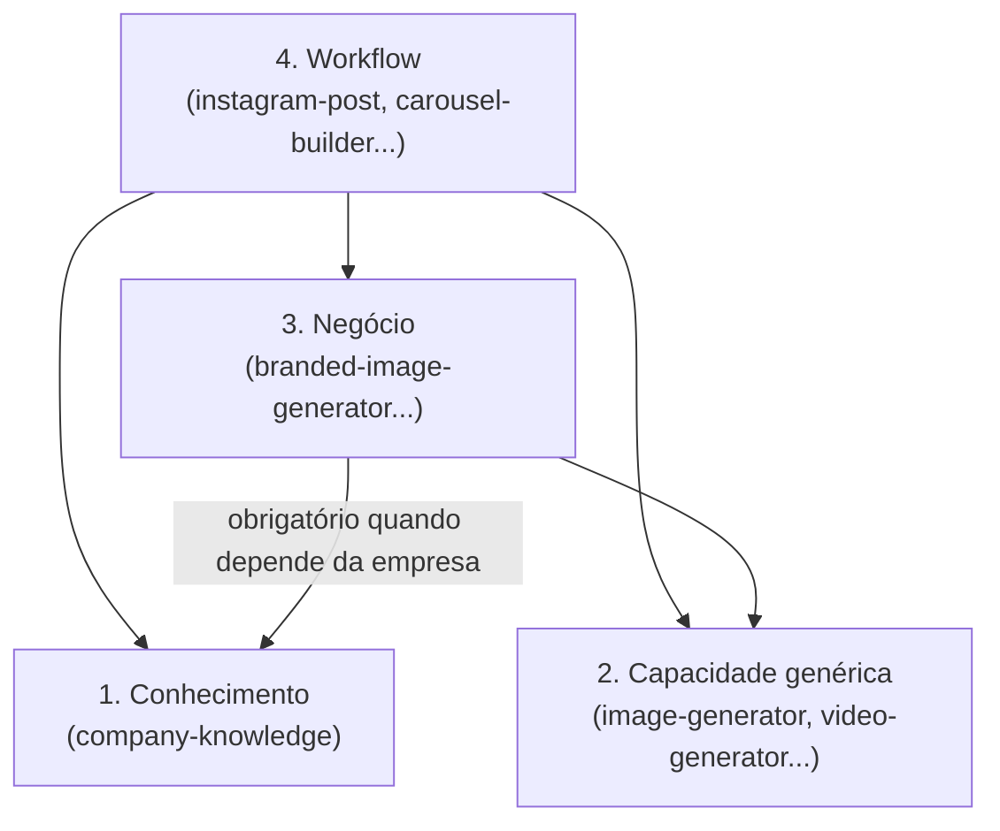
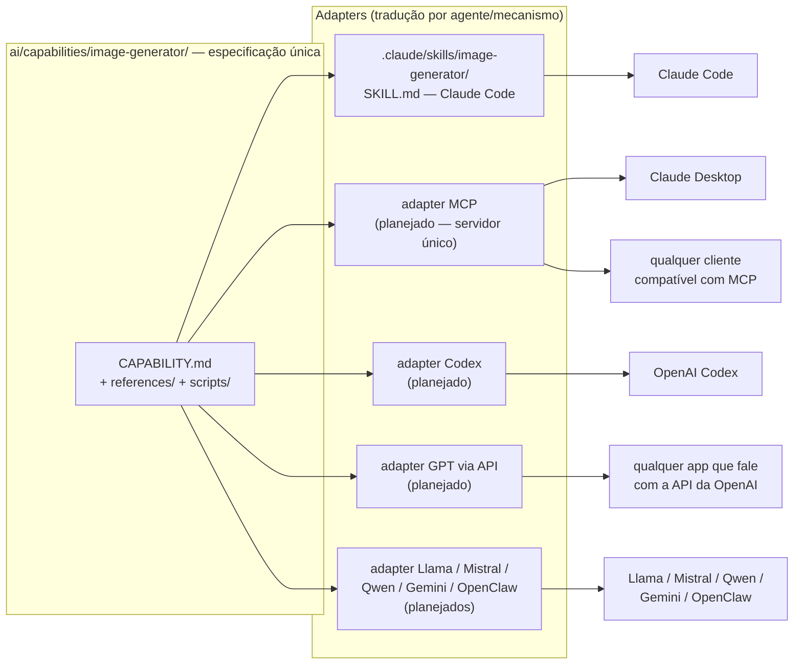
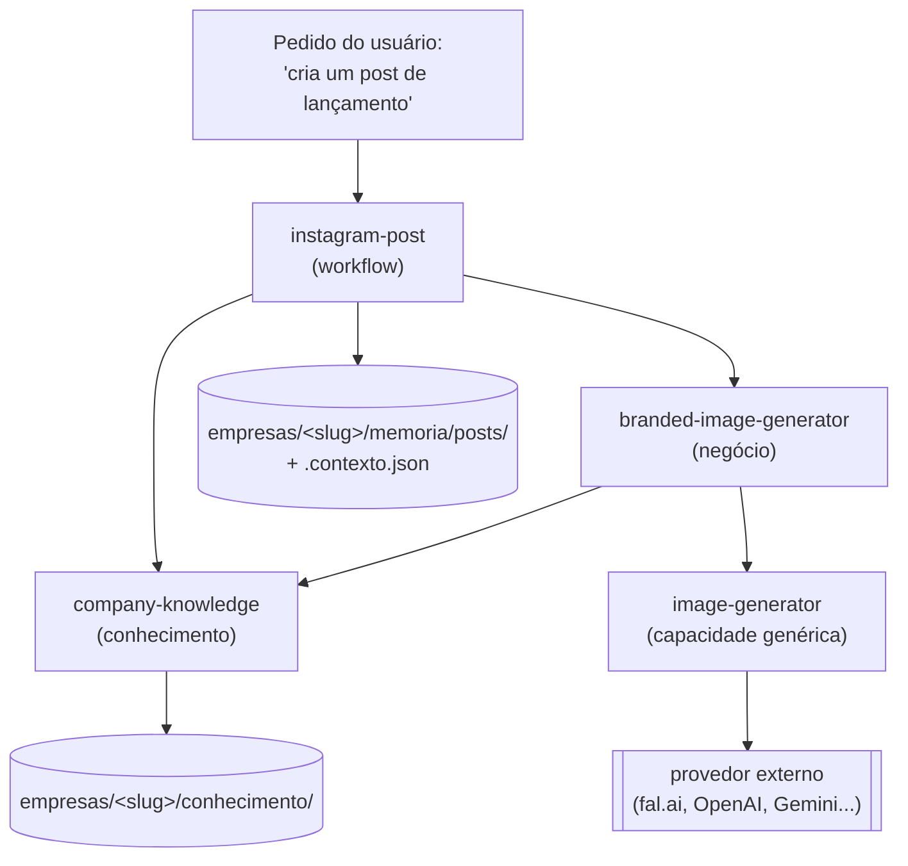
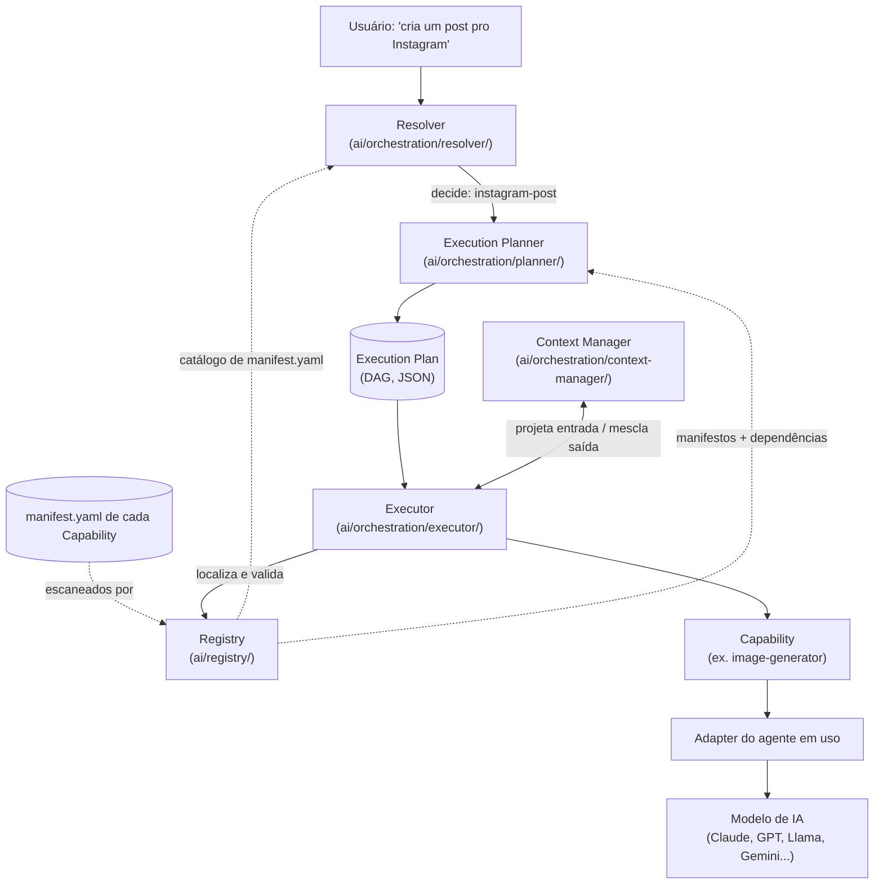
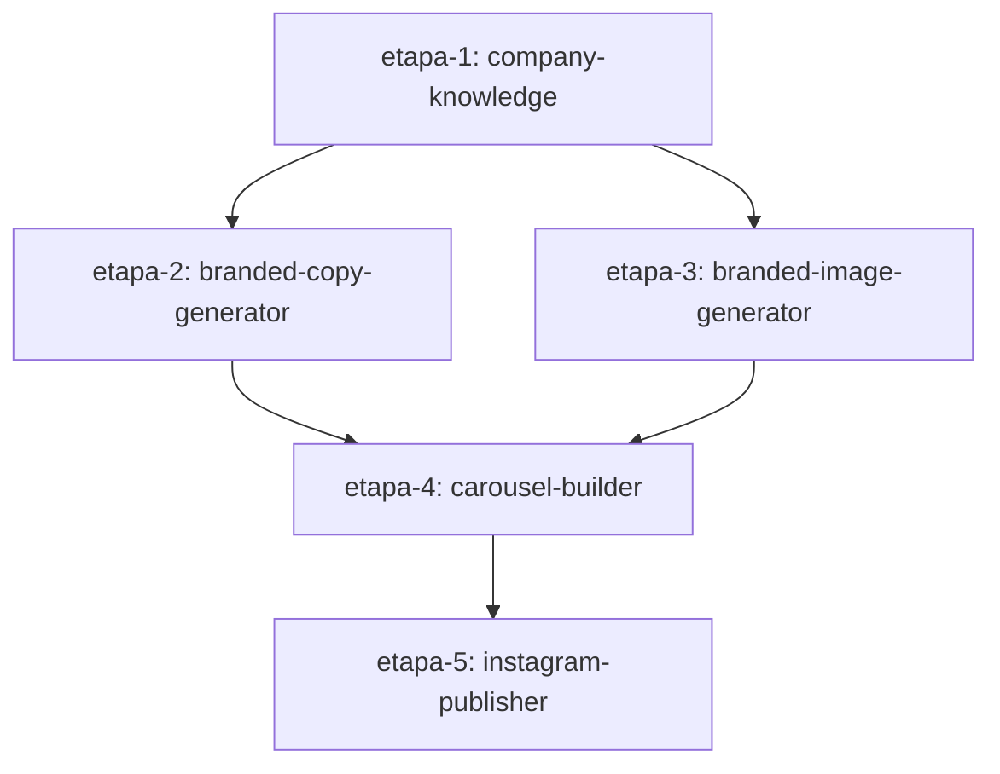
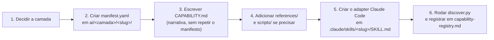

# Diagramas

Vistas complementares da arquitetura. Todas em Mermaid (renderiza no
GitHub, VS Code e na maioria dos visualizadores de Markdown); cada uma tem
uma legenda em texto logo abaixo para quem estiver lendo em um lugar sem
suporte a Mermaid.

## 1. As quatro camadas (dependência unidirecional)

Leitura: a seta sempre aponta de "quem chama" para "quem é chamado", e
nunca sobe. Workflow pode chamar as outras três; Negócio pode chamar
Conhecimento e Capacidade genérica, mas nunca Workflow nem outra Negócio;
Capacidade genérica e Conhecimento não chamam nada fora da própria camada
(regras completas em `dependencias-permitidas.md`).

## 2. Capability, Adapters e agentes de IA

Leitura: **uma** especificação (`CAPABILITY.md`), **N** adapters finos, cada
um traduzindo para o mecanismo de um agente (ou protocolo). O adapter MCP é
o caso especial — ele não é "mais um agente", é um protocolo; escrever um
único servidor MCP em cima de uma Capability potencialmente atende
qualquer cliente MCP de uma vez, em vez de um adapter por agente (ver
`ai/adapters/README.md#mcp-como-adapter-universal`). Hoje só o adapter
Claude Code existe de verdade — os demais são o roadmap, não implementação.

## 3. Fluxo de negócio completo (workflow → negócio → conhecimento/capacidade)

Leitura: o workflow nunca fala com o provedor de imagem nem lê
`empresas/` diretamente — sempre atravessa a Capability de Negócio (que
por sua vez sempre consulta Conhecimento antes de chamar a Capacidade
genérica). O Context Contract (`ai/contracts/context-contract.md`) é o que
viaja em cada seta que sai de `company-knowledge` ou de `branded-image-generator`.
O resultado final e o contrato usado são persistidos em `memoria/` para
auditoria.

## 4. Fluxo completo: Usuário → Resolver → Planner → Plan → Executor → Registry → Capability → Adapter → Modelo de IA

Leitura: o Resolver decide *o quê*; o Planner decide *como* (o plano); o
Executor *roda* o plano já pronto, sempre consultando o Registry para
achar/validar cada Capability e o Context Manager para saber o que passar
de entrada e onde guardar o que sai. Nenhum componente pula etapa nem
assume o papel de outro (ver `ai/orchestration/README.md#regra-de-desacoplamento-objetivo-central-desta-camada`).
Só o Adapter sabe qual agente de IA está rodando por baixo — todo o resto
da cadeia é agnóstico disso.

## 5. Por que o Execution Plan é um DAG, não uma lista

Leitura: `etapa-2` e `etapa-3` só dependem de `etapa-1` — nada as impede
de rodar ao mesmo tempo. Numa lista sequencial isso ficaria invisível (só
daria pra ver "2 vem depois de 1, 3 vem depois de 2"); no DAG, fica
explícito que 2 e 3 são independentes entre si. `branded-copy-generator`,
`branded-image-generator`, `carousel-builder` e `instagram-publisher` são
nomes ilustrativos deste exemplo (ver `ai/contracts/execution-plan-schema.md`)
— nenhuma dessas Capabilities existe ainda.

## Como criar uma Capability nova, em uma linha por etapa

Isto já está descrito em detalhe em `ARQUITETURA.md` e
`convencoes-globais.md`; aqui vai só o roteiro visual:

